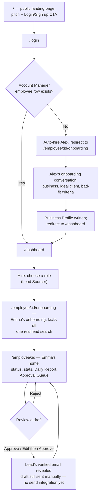

# User Journey: Hiring & Managing Emma, the Lead Sourcer

## 1. Overview

**Persona**
A small business owner who needs outbound sales pipeline but has no time (or dedicated staff) to research leads and write outreach emails every day. Not technical; thinks in terms of "hiring help," not "configuring software."

**User Goal**
Get a steady stream of qualified, personalized outbound leads without doing the research or writing themselves — by "hiring" an AI employee (Emma, the Lead Sourcer) and reviewing her work each day.

**Preconditions**

- User can articulate, in plain language, what their business does, their ideal client, and what a bad lead looks like — conversationally, in response to Alex's (the Account Manager's) questions.
- Every hire — Alex or Emma — is a row in the `employees` table (see [DATABASE.md](DATABASE.md)) with its own onboarding page and home page at `/employee/:id` and `/employee/:id/onboarding`. Alex is auto-hired the first time a user reaches `/` authenticated with no `account_manager` employee row yet — that row's presence/absence is the first-run signal, not `business_profiles`.

---

## 2. User Journey Diagram

## 3. Journey Details Table

| Stage                          | User Goal                                                | User Action                                     | System Behavior                                                                                                                                                                                                                                                            | Pain Points                                                                                        | Success Metric                                                                                    |
| ------------------------------ | -------------------------------------------------------- | ------------------------------------------------ | ---------------------------------------------------------------------------------------------------------------------------------------------------------------------------------------------------------------------------------------------------------------------------- | -------------------------------------------------------------------------------------------------- | ------------------------------------------------------------------------------------------------- |
| Landing page (`/`)             | Understand what the product does                         | Views pitch                                     | Shows single CTA to log in / sign up; if already authenticated, `/` never renders the pitch — it redirects onward instead                                                                                                                                                 | Unclear value prop if pitch is too abstract                                                        | % of visitors who click the CTA                                                                   |
| Login (`/login`)               | Get into the product                                     | Logs in / signs up                              | Authenticates via Supabase, then `/` decides where to send the user based on whether an `account_manager` employee row exists                                                                                                                                             | Friction from auth itself (magic-link email round trip)                                            | Login completion rate                                                                              |
| Alex's onboarding (`/employee/:id/onboarding`) | Get the product set up to understand the business | Answers Alex's questions (business, ideal client, bad-fit criteria, name) | Only reached when no Account Manager employee exists yet (auto-hired); Alex asks questions conversationally and writes the Business Profile so every future role can reuse it without re-asking                                                                          | Conversational format may feel slower than a form for some users                                   | % of first-run users who complete onboarding and reach `/dashboard`                                |
| Choose a role (`/dashboard`)   | Decide who to hire                                       | Selects "Lead Sourcer" (only option)             | Roster of hired employees plus a hire catalog; Lead Sourcer shows as hireable until the user has one, then links to her page instead                                                                                                                                      | May feel like an unnecessary extra click                                                           | % who proceed past role selection                                                                 |
| Emma's onboarding (`/employee/:id/onboarding`) | Finish hiring                             | Confirms hire                                   | Marks the employee active and kicks off the first real lead search, seeded from Alex's Business Profile                                                                                                                                                                   | Waiting on live search results                                                                     | Hire completion rate                                                                               |
| Emma's home (`/employee/:id`)  | Review Emma's work and see what she's found for this run | Approves, rejects, or edits draft leads/emails  | Renders status, stats, today's report, and Approval Queue together; approving a lead reveals its verified email address, but the drafted email is still sent manually — no send integration yet; feedback will shape future runs once recurring automation ships          | Reviewing every item may feel like a chore; no history view yet, and this run isn't persisted — a reload loses it | Approved email drafts (core success metric per [roles/lead-sourcer.md](../roles/lead-sourcer.md)) |

**Note:** Emma's hire flow no longer asks for ideal client / good-fit criteria — that's now covered once by Alex's Business Profile, which her first search reads directly. Her onboarding today is a single placeholder question; her real question set (lead-type preferences, etc.) is designed later.
