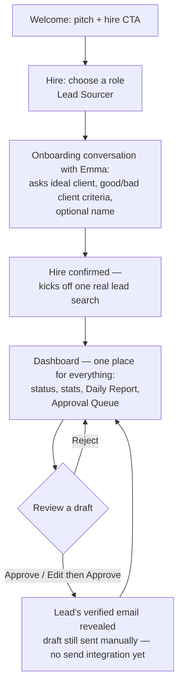

# User Journey: Hiring & Managing Emma, the Lead Sourcer

## 1. Overview

**Persona**
A small business owner who needs outbound sales pipeline but has no time (or dedicated staff) to research leads and write outreach emails every day. Not technical; thinks in terms of "hiring help," not "configuring software."

**User Goal**
Get a steady stream of qualified, personalized outbound leads without doing the research or writing themselves — by "hiring" an AI employee (Emma, the Lead Sourcer) and reviewing her work each day.

**Preconditions**

- User can articulate, in plain language, their ideal client and what a bad lead looks like — conversationally, in response to Emma's questions.
- No prior employees, assignments, or account state exist (first-run experience).

---

## 2. User Journey Diagram

## 3. Journey Details Table

| Stage                   | User Goal                                                | User Action                                                                    | System Behavior                                                                                                                                                                                                                                                            | Pain Points                                                                                        | Success Metric                                                                                    |
| ----------------------- | -------------------------------------------------------- | ------------------------------------------------------------------------------ | -------------------------------------------------------------------------------------------------------------------------------------------------------------------------------------------------------------------------------------------------------------------------- | -------------------------------------------------------------------------------------------------- | ------------------------------------------------------------------------------------------------- |
| Welcome                 | Understand what the product does                         | Views pitch                                                                    | Shows single CTA: "Hire your first employee"                                                                                                                                                                                                                               | Unclear value prop if pitch is too abstract                                                        | % of visitors who click hire CTA                                                                  |
| Choose a role           | Decide who to hire                                       | Selects "Lead Sourcer" (only option)                                           | Displays role even with one choice, to set the hiring mental model                                                                                                                                                                                                         | May feel like an unnecessary extra click                                                           | % who proceed past role selection                                                                 |
| Onboarding conversation | Get Emma set up to do the job                            | Answers Emma's questions (ideal client, good/bad lead criteria, optional name) | Emma asks questions conversationally rather than presenting a form                                                                                                                                                                                                         | Conversational format may feel slower than a form for some users                                   | % of users who complete onboarding conversation                                                   |
| Confirm                 | Finish hiring                                            | Reviews and confirms                                                           | Marks employee as hired and kicks off the first real lead search                                                                                                                                                                                                           | Waiting on live search results                                                                     | Hire completion rate                                                                              |
| Dashboard (single view) | Review Emma's work and see what she's found for this run | Approves, rejects, or edits draft leads/emails                                 | Dashboard renders status, stats, today's report, and Approval Queue together; approving a lead reveals its verified email address, but the drafted email is still sent manually — no send integration yet; feedback will shape future runs once recurring automation ships | Reviewing every item may feel like a chore; no history view yet since only one run exists per hire | Approved email drafts (core success metric per [roles/lead-sourcer.md](../roles/lead-sourcer.md)) |
