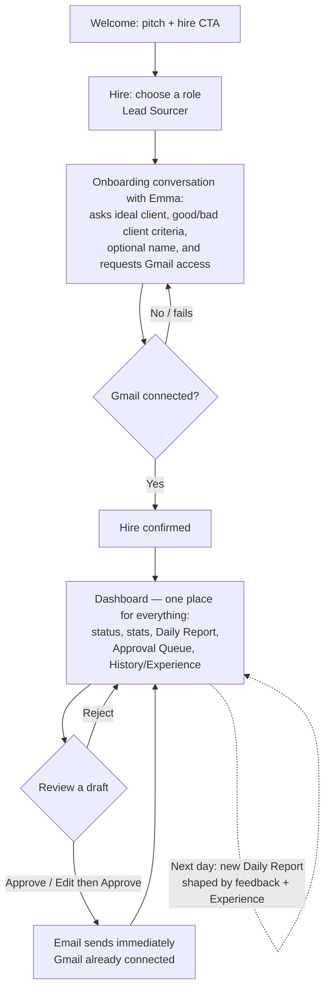

# User Journey: Hiring & Managing Emma, the Lead Sourcer

## 1. Overview

**Persona**
A small business owner who needs outbound sales pipeline but has no time (or dedicated staff) to research leads and write outreach emails every day. Not technical; thinks in terms of "hiring help," not "configuring software."

**User Goal**
Get a steady stream of qualified, personalized outbound leads without doing the research or writing themselves — by "hiring" an AI employee (Emma, the Lead Sourcer) and reviewing her work each day.

**Preconditions**

- User has a Gmail account available to connect when Emma asks for it during onboarding — onboarding cannot complete without it.
- User can articulate, in plain language, their ideal client and what a bad lead looks like — conversationally, in response to Emma's questions.
- No prior employees, assignments, or account state exist (first-run experience).

---

## 2. User Journey Diagram

---

## 3. Journey Details Table

| Stage                   | User Goal                                                                                  | User Action                                                                                                                 | System Behavior                                                                                                                                                                                                                                                                                | Pain Points                                                                                                                                   | Success Metric                                                                                                                      |
| ----------------------- | ------------------------------------------------------------------------------------------ | --------------------------------------------------------------------------------------------------------------------------- | ---------------------------------------------------------------------------------------------------------------------------------------------------------------------------------------------------------------------------------------------------------------------------------------------- | --------------------------------------------------------------------------------------------------------------------------------------------- | ----------------------------------------------------------------------------------------------------------------------------------- |
| Welcome                 | Understand what the product does                                                           | Views pitch                                                                                                                 | Shows single CTA: "Hire your first employee"                                                                                                                                                                                                                                                   | Unclear value prop if pitch is too abstract                                                                                                   | % of visitors who click hire CTA                                                                                                    |
| Choose a role           | Decide who to hire                                                                         | Selects "Lead Sourcer" (only option)                                                                                        | Displays role even with one choice, to set the hiring mental model                                                                                                                                                                                                                             | May feel like an unnecessary extra click                                                                                                      | % who proceed past role selection                                                                                                   |
| Onboarding conversation | Get Emma set up to do the job                                                              | Answers Emma's questions (ideal client, good/bad lead criteria, optional name) and connects Gmail when asked                | Emma asks questions conversationally rather than presenting a form; requests Gmail access as a required part of the same conversation                                                                                                                                                          | Conversational format may feel slower than a form for some users; hard requirement to connect Gmail may block users not ready to grant access | % of users who complete onboarding conversation; % who connect Gmail successfully                                                   |
| Confirm                 | Finish hiring                                                                              | Reviews and confirms                                                                                                        | Marks employee as hired; only reachable once Gmail is connected                                                                                                                                                                                                                                | Onboarding cannot be completed without Gmail — no partial hire                                                                                | Hire completion rate                                                                                                                |
| Dashboard (single view) | Review Emma's work, see fresh work each day, and see what she's learned — all in one place | Approves, rejects, or edits draft leads/emails; scrolls the same view to see past days' reports and approved/rejected leads | One dashboard renders status, stats, today's report, Approval Queue, and History/Experience together; approved emails send immediately since Gmail is always already connected; each new day surfaces fresh work shaped by prior feedback, with nothing to configure or navigate to separately | Reviewing every item daily may feel like a chore; a single dense view could get long over time as history grows                               | Approved email drafts (core success metric per [employees/lead-sourcer.md](../employees/lead-sourcer.md)); daily active return rate |
