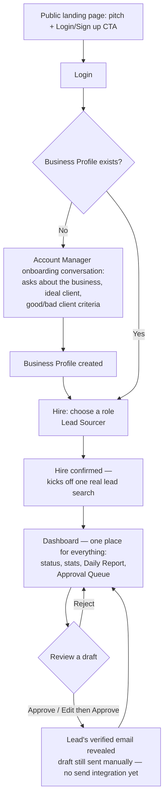

# User Journey: Hiring & Managing Emma, the Lead Sourcer

## 1. Overview

**Persona**
A small business owner who needs outbound sales pipeline but has no time (or dedicated staff) to research leads and write outreach emails every day. Not technical; thinks in terms of "hiring help," not "configuring software."

**User Goal**
Get a steady stream of qualified, personalized outbound leads without doing the research or writing themselves — by "hiring" an AI employee (Emma, the Lead Sourcer) and reviewing her work each day.

**Preconditions**

- User can articulate, in plain language, what their business does, their ideal client, and what a bad lead looks like — conversationally, in response to the Account Manager's questions.
- No prior employees, assignments, or account state exist (first-run experience). A user with no Business Profile yet is treated as first-run regardless of login history.

---

## 2. User Journey Diagram

## 3. Journey Details Table

| Stage                          | User Goal                                                | User Action                                     | System Behavior                                                                                                                                                                                                                                                            | Pain Points                                                                                        | Success Metric                                                                                    |
| ------------------------------ | -------------------------------------------------------- | ------------------------------------------------ | ---------------------------------------------------------------------------------------------------------------------------------------------------------------------------------------------------------------------------------------------------------------------------- | -------------------------------------------------------------------------------------------------- | ------------------------------------------------------------------------------------------------- |
| Landing page                   | Understand what the product does                         | Views pitch                                     | Shows single CTA to log in / sign up                                                                                                                                                                                                                                       | Unclear value prop if pitch is too abstract                                                        | % of visitors who click the CTA                                                                   |
| Login                          | Get into the product                                     | Logs in / signs up                              | Authenticates via Supabase, then checks whether a `business_profiles` row exists for this user                                                                                                                                                                            | Friction from auth itself (password, email verification)                                           | Login completion rate                                                                             |
| Account Manager onboarding     | Get the product set up to understand the business        | Answers Account Manager's questions (business, ideal client, good/bad lead criteria) | Only shown when no Business Profile exists yet; Account Manager asks questions conversationally and writes the Business Profile so every role can reuse it without re-asking                                                                                              | Conversational format may feel slower than a form for some users                                   | % of first-run users who complete onboarding and reach role selection                             |
| Choose a role                  | Decide who to hire                                       | Selects "Lead Sourcer" (only option)             | Displays role even with one choice, to set the hiring mental model; skipped straight to for returning users who already have a Business Profile                                                                                                                          | May feel like an unnecessary extra click                                                           | % who proceed past role selection                                                                 |
| Confirm                        | Finish hiring                                            | Reviews and confirms                            | Marks employee as hired and kicks off the first real lead search                                                                                                                                                                                                           | Waiting on live search results                                                                     | Hire completion rate                                                                              |
| Dashboard (single view)        | Review Emma's work and see what she's found for this run | Approves, rejects, or edits draft leads/emails  | Dashboard renders status, stats, today's report, and Approval Queue together; approving a lead reveals its verified email address, but the drafted email is still sent manually — no send integration yet; feedback will shape future runs once recurring automation ships | Reviewing every item may feel like a chore; no history view yet since only one run exists per hire | Approved email drafts (core success metric per [roles/lead-sourcer.md](../roles/lead-sourcer.md)) |

**Note:** Emma's hire flow no longer asks for ideal client / good-bad lead criteria — that's now covered once by the Account Manager's Business Profile. A lighter, role-specific onboarding pass for Emma (e.g. tone, signature name) may be added later; not part of this change.
